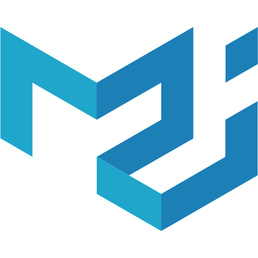
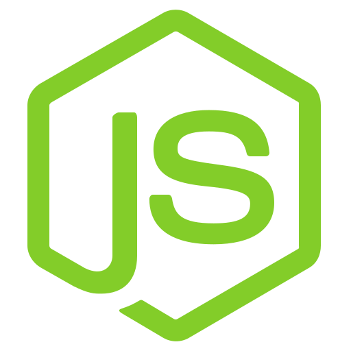
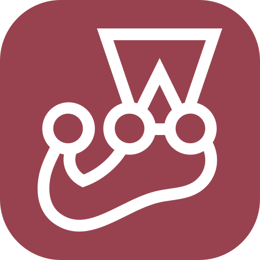
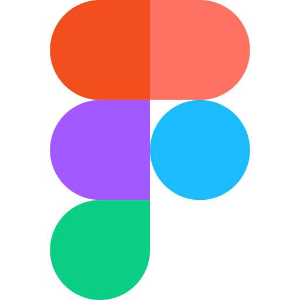

## Hey, I'm Kevin Corman

  
  

#### Software Developer — TypeScript • React • Next.js

* Currently learning Go to expand my backend and tooling skills.
* Focused on building software that solves real-world needs and delivers value to communities.

---

#### Live in Production

Real, deployed tools built to solve actual problems.

* **JudoSensei**
  An interactive PWA designed for the Judo community to help students study and prepare for grading examinations.
  👉 [Launch App](https://judosensei.online/)

* **GameCenter**
  A functional platform centralizing interactive utility tools and gaming experiences.
  👉 [Launch App](https://game-center-akcs.netlify.app/)

---

#### Tech Stack & Skills

##### Frontend

  
  
  
  
  

##### Backend & Databases

  
  
  

##### Testing & Tools

  
  
  

